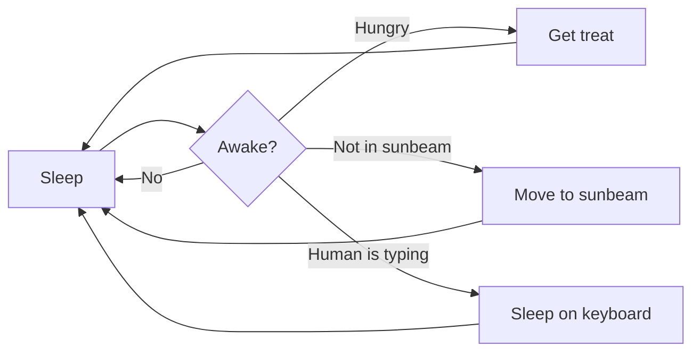

# Glue3D

Glue3D is a custom scripting language for game and 3D project development, designed for clean structure and readable syntax.

> [!IMPORTANT]
> You need to use Droplets Utils to import .glue3d files
> Currently in Beta

---

## Features

- Custom syntax highlighting for `.glue3d` files
- Autocomplete snippets for core engine blocks
- Structured control flow:
  - `for` / `endfor`
  - `if` / `endif`
  - `repeat` / `endrepeat`
- Engine modules:
  - `game`
  - `physics`
  - `model`
  - `sound`
  - `interface`
  - `editor`
  - `terminal`
  - `file`
- Built-in `wait` keyword
- Comment support (`// comment`)

---

## Example

```py
// Basic example

for i in range 10
    game.start()
    physics.update()
    wait 1
endfor

if score > 100
    sound.play(str "victory_chime")
endif
```
```glue3d
// Basic example

for i in range 10
    game.start()
    physics.update()
    wait 1
endfor

if score > 100
    sound.play(str "victory_chime")
endif
```



